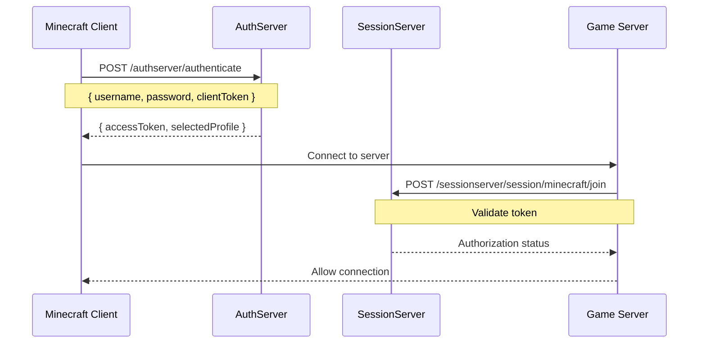

# 🌳 TypedrasilService

> **Custom Minecraft authentication service with skins and capes support**

[](https://typescriptlang.org/)
[](https://bun.sh/)
[](https://elysiajs.com/)
[](https://postgresql.org/)
[](https://redis.io/)
[](https://docker.com/)

[](https://opensource.org/licenses/MIT)
[](http://makeapullrequest.com)
[](https://github.com/hodwini/typedrasilservice/releases)

[🇷🇺 Русская версия](README_ru.md) | [🇺🇸 English](README.md)

---

## 📖 Description

**TypedrasilService** is a modern implementation of the Yggdrasil protocol for creating an independent Minecraft authentication system. It allows server owners and project creators to build their own ecosystem with custom skins, capes, and full control over users.

### ✨ Key Features

- 🔐 **Full Minecraft Authentication** — compatibility with official Yggdrasil protocol
- 👤 **Profile Management** — multiple game profiles per user
- 🎨 **Custom Skins** — upload and manage skins (Steve/Alex models)
- 🦸 **Capes** — support for custom player capes
- 🔒 **Security** — JWT tokens, password hashing, brute force protection
- 📊 **Monitoring** — logging, metrics, health checks
- 🐳 **Docker Ready** — full containerization for easy deployment
- 📚 **OpenAPI** — auto-generated API documentation

---

## 🛠 Technology Stack

### Backend
- **[Bun](https://bun.sh/)** — ultra-fast JavaScript runtime and package manager
- **[Elysia](https://elysiajs.com/)** — high-performance web framework for Bun
- **[TypeScript](https://typescriptlang.org/)** — typed JavaScript for code reliability
- **[Drizzle ORM](https://orm.drizzle.team/)** — type-safe ORM for database operations

### Database
- **[PostgreSQL 15](https://postgresql.org/)** — main relational database
- **[Redis 7](https://redis.io/)** — caching and sessions

### DevOps
- **[Docker](https://docker.com/)** — application containerization
- **[Docker Compose](https://docs.docker.com/compose/)** — container orchestration
- **Make** — development task automation

---

## 🎯 How Yggdrasil Protocol Works

**Yggdrasil** is Minecraft's authentication protocol that provides secure player authentication. Our service fully replicates its functionality:

### 🔄 Authentication Process



### 🔑 Main Endpoints

| Endpoint | Description | Method |
|----------|-------------|--------|
| `/authserver/authenticate` | User authentication | `POST` |
| `/authserver/refresh` | Token refresh | `POST` |
| `/authserver/validate` | Token validation | `POST` |
| `/authserver/invalidate` | Token invalidation | `POST` |
| `/authserver/signout` | Sign out from all sessions | `POST` |
| `/sessionserver/session/minecraft/join` | Join server | `POST` |
| `/sessionserver/session/minecraft/hasJoined` | Check authorization | `GET` |
| `/sessionserver/session/minecraft/profile/{uuid}` | Get player profile | `GET` |

### 🧩 Token Structure

```typescript
interface AccessToken {
  accessToken: string    // Unique access token
  clientToken: string    // Client token (for device binding)
  selectedProfile: {     // Selected game profile
    id: string          // Player UUID (without dashes)
    name: string        // Game name
  }
}
```

---

## 🚀 Quick Start

### Prerequisites

- **[Bun](https://bun.sh/)** v1.0+
- **[Docker](https://docker.com/)** & **Docker Compose**
- **[PostgreSQL](https://postgresql.org/)** 15+ (or via Docker)
- **[Git](https://git-scm.com/)**

### 1️⃣ Clone Repository

```bash
git clone https://github.com/Hodwini/typedrasilservice.git
cd typedrasilservice
```

### 2️⃣ Install Dependencies

```bash
bun install
```

### 3️⃣ Environment Setup

```bash
# Create configuration file
cp .env.example .env

# Edit variables
nano .env
```

**Required variables to fill:**
```bash
# Secret keys
JWT_SECRET=your_super_secret_jwt_key_here_32_chars_min
DB_PASSWORD=strong_password

# Database
DB_NAME=typedrasil-dev
DB_USERNAME=postgres
```

### 4️⃣ Run with Docker

```bash
# Build and start all services
make build
make up

# Apply migrations
make migrate

# View logs
make logs
```

### 5️⃣ Health Check

```bash
# Health check
curl http://localhost:3000/health

# API documentation
open http://localhost:3000/docs
```

---

## 💻 Local Development

### Project Structure

```
typedrasilservice/
├── 📁 src/
│   ├── 📁 database/           # Database and schemas
│   │   ├── 📁 schemas/        # Drizzle table schemas
│   │   └── 📄 index.ts        # DB connection
│   ├── 📁 handlers/           # HTTP handlers
│   ├── 📁 middlewares/        # Middleware functions
│   ├── 📁 services/           # Business logic
│   ├── 📁 types/              # TypeScript types
│   └── 📄 index.ts            # Entry point
├── 📁 drizzle/                # DB migrations
├── 📄 docker-compose.yml      # Docker configuration
├── 📄 Dockerfile              # Docker image
├── 📄 Makefile                # Automation commands
└── 📄 drizzle.config.ts       # ORM configuration
```

### Development Commands

```bash
# Development
bun dev                    # Run in development mode
bun start                  # Run production version

# Database
bun db:generate           # Generate migrations
bun db:migrate            # Apply migrations  
bun db:push               # Direct schema update
bun db:studio             # Drizzle Studio UI

# Docker
make up                   # Start containers
make down                 # Stop containers
make logs                 # View logs
make clean                # Clean containers
```

### API Testing

**Create user:**
```bash
curl -X POST http://localhost:3000/api/register \
  -H "Content-Type: application/json" \
  -d '{
    "email": "test@example.com",
    "username": "TestUser",
    "password": "SecurePass123"
  }'
```

**Authentication:**
```bash
curl -X POST http://localhost:3000/authserver/authenticate \
  -H "Content-Type: application/json" \
  -d '{
    "agent": {
      "name": "Minecraft",
      "version": 1
    },
    "username": "test@example.com",
    "password": "SecurePass123",
    "clientToken": "client-token-123"
  }'
```

### Debugging and Logging

Set `LOG_LEVEL=debug` in `.env` for detailed logs:

```bash
# In .env
LOG_LEVEL=debug
NODE_ENV=development
```

---

## 🌐 Production Deployment

### Server Preparation

**System Requirements:**
- **OS:** Ubuntu 20.04+ / CentOS 8+ / Debian 11+
- **RAM:** minimum 2GB, recommended 4GB+
- **CPU:** 2+ cores
- **Storage:** 20GB+ SSD
- **Network:** public IP address

### 1️⃣ Install Docker

```bash
# Ubuntu/Debian
curl -fsSL https://get.docker.com -o get-docker.sh
sh get-docker.sh

# Add user to docker group
sudo usermod -aG docker $USER
newgrp docker

# Install Docker Compose
sudo curl -L "https://github.com/docker/compose/releases/download/v2.20.0/docker-compose-$(uname -s)-$(uname -m)" -o /usr/local/bin/docker-compose
sudo chmod +x /usr/local/bin/docker-compose
```

### 2️⃣ Project Setup

```bash
# Clone to server
git clone https://github.com/Hodwini/typedrasilservice.git
cd typedrasilservice

# Create production configuration
cp .env.example .env.production
```

**Production `.env.production`:**
```bash
# Server Bootstrap
NODE_ENV=production
SERVER_PORT=3000
CORS_ORIGIN=https://your-domain.com
LOG_LEVEL=info

# Server Security (MUST CHANGE!)
JWT_SECRET=super_secure_random_string_min_32_chars_production
JWT_TOKEN=another_secure_token_for_production
JWT_EXPIRATION=24h

# PostgreSQL
DB_HOST=localhost
DB_PORT=5432
DB_USERNAME=postgres
DB_PASSWORD=very_strong_password_123!
DB_NAME=typedrasil-prod

# Redis
REDIS_HOST=localhost
REDIS_PORT=6379
REDIS_PASSWORD=redis_strong_password_456!
```

### 3️⃣ Firewall Setup

```bash
# UFW (Ubuntu)
sudo ufw allow 22/tcp      # SSH
sudo ufw allow 80/tcp      # HTTP
sudo ufw allow 443/tcp     # HTTPS
sudo ufw allow 3000/tcp    # API (temporary for testing)
sudo ufw enable

# firewalld (CentOS/RHEL)
sudo firewall-cmd --permanent --add-port=22/tcp
sudo firewall-cmd --permanent --add-port=80/tcp
sudo firewall-cmd --permanent --add-port=443/tcp
sudo firewall-cmd --permanent --add-port=3000/tcp
sudo firewall-cmd --reload
```

### 4️⃣ Production Launch

```bash
# Use production configuration
cp .env.production .env

# Build and run
make prod

# Check status
make status

# View logs
make logs-app
```

### 5️⃣ Nginx Setup (Optional)

**Install Nginx:**
```bash
sudo apt update
sudo apt install nginx
```

**Configuration `/etc/nginx/sites-available/typedrasil`:**
```nginx
server {
    listen 80;
    server_name your-domain.com;

    # Redirect to HTTPS
    return 301 https://$server_name$request_uri;
}

server {
    listen 443 ssl http2;
    server_name your-domain.com;

    # SSL certificates (use Let's Encrypt)
    ssl_certificate /etc/letsencrypt/live/your-domain.com/fullchain.pem;
    ssl_certificate_key /etc/letsencrypt/live/your-domain.com/privkey.pem;

    # Proxy to application
    location / {
        proxy_pass http://localhost:3000;
        proxy_set_header Host $host;
        proxy_set_header X-Real-IP $remote_addr;
        proxy_set_header X-Forwarded-For $proxy_add_x_forwarded_for;
        proxy_set_header X-Forwarded-Proto $scheme;
    }

    # Logs
    access_log /var/log/nginx/typedrasil_access.log;
    error_log /var/log/nginx/typedrasil_error.log;
}
```

**Activate configuration:**
```bash
sudo ln -s /etc/nginx/sites-available/typedrasil /etc/nginx/sites-enabled/
sudo nginx -t
sudo systemctl reload nginx
```

### 6️⃣ SSL Certificate (Let's Encrypt)

```bash
# Install Certbot
sudo apt install certbot python3-certbot-nginx

# Get certificate
sudo certbot --nginx -d your-domain.com

# Auto-renewal
sudo crontab -e
# Add: 0 12 * * * /usr/bin/certbot renew --quiet
```

### 7️⃣ Monitoring and Logs

**Systemd service for auto-start:**
```bash
# Create /etc/systemd/system/typedrasil.service
sudo nano /etc/systemd/system/typedrasil.service
```

```ini
[Unit]
Description=Typedrasil Service
After=docker.service
Requires=docker.service

[Service]
Type=oneshot
RemainAfterExit=yes
WorkingDirectory=/path/to/typedrasilservice
ExecStart=/usr/local/bin/docker-compose up -d
ExecStop=/usr/local/bin/docker-compose down
TimeoutStartSec=0

[Install]
WantedBy=multi-user.target
```

```bash
# Enable service
sudo systemctl enable typedrasil.service
sudo systemctl start typedrasil.service
```

**Logs and monitoring:**
```bash
# View application logs
make logs-app

# System logs
sudo journalctl -u typedrasil.service -f

# Resource monitoring
docker stats

# Health check
curl https://your-domain.com/health
```

---

## 🔧 Minecraft Client Configuration

To use custom authentication server in Minecraft:

### Official Client
Requires modification or use of launchers like MultiMC, PolyMC.

### Custom Launchers
- **MultiMC/PolyMC:** Settings → Accounts → Add Microsoft/Mojang → Custom Server
- **TLauncher:** Settings → Authentication → Custom server

**URL configuration:**
```
Auth Server: https://your-domain.com/authserver
Session Server: https://your-domain.com/sessionserver
```

---

## 📊 API Documentation

API is automatically documented via OpenAPI/Swagger.

**Documentation access:**
- 🌐 **Swagger UI:** `http://localhost:3000/docs`
- 📄 **OpenAPI JSON:** `http://localhost:3000/docs/json`

### Main Endpoints

#### Authentication
```http
POST /authserver/authenticate
POST /authserver/refresh  
POST /authserver/validate
POST /authserver/invalidate
POST /authserver/signout
```

#### Sessions
```http
POST /sessionserver/session/minecraft/join
GET  /sessionserver/session/minecraft/hasJoined
GET  /sessionserver/session/minecraft/profile/{uuid}
```

#### Management
```http
GET  /health
GET  /api/users/profile
POST /api/skins/upload
POST /api/capes/upload
```

---

## 🤝 Contributing

We welcome contributions to the project! 

### How to Contribute

1. **Fork** the repository
2. Create a **feature branch** (`git checkout -b feature/amazing-feature`)
3. **Commit** changes (`git commit -m 'Add amazing feature'`)
4. **Push** to branch (`git push origin feature/amazing-feature`)
5. Open a **Pull Request**

### Code Standards

- ✅ **TypeScript** — strict typing
- ✅ **ESLint** — code linting
- ✅ **Prettier** — code formatting
- ✅ **Conventional Commits** — commit standard

### Testing

```bash
# Run tests
bun test

# Test with coverage  
bun test --coverage

# E2E tests
bun test:e2e
```

---

## 🐛 Known Issues

### Performance
- **Issue:** High DB load with many concurrent requests
- **Solution:** Use Redis for token and profile caching

### Security  
- **Issue:** Brute force attacks on `/authenticate` endpoint
- **Solution:** Rate limiting and temporary IP blocking implemented

### Compatibility
- **Issue:** Some mods may not work with custom servers
- **Solution:** Check mod compatibility with your launcher

---

## 📝 License

This project is licensed under the **MIT License** - see the [LICENSE](LICENSE) file for details.

---

## ❤️ Acknowledgments

- **[Mojang Studios](https://mojang.com/)** — for creating Minecraft and the Yggdrasil protocol
- **[Bun Team](https://bun.sh/)** — for the incredibly fast runtime
- **[Elysia](https://elysiajs.com/)** — for the elegant web framework
- **[Drizzle Team](https://orm.drizzle.team/)** — for the type-safe ORM

---

## 📞 Support

- 🐛 **Bugs:** [GitHub Issues](https://github.com/hodwini/typedrasilservice/issues)
- 💬 **Discussions:** [GitHub Discussions](https://github.com/hodwini/typedrasilservice/discussions)

---

<div align="center">

**⭐ If you like the project, please star it on GitHub!**

Made with ❤️ by [nsvk13](https://github.com/nsvk13)

</div>