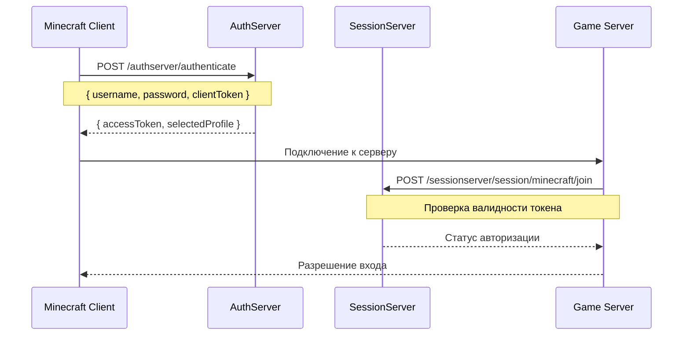

# 🌳 TypedrasilService

> **Кастомный сервис авторизации для Minecraft с поддержкой скинов и плащей**

[](https://typescriptlang.org/)
[](https://bun.sh/)
[](https://elysiajs.com/)
[](https://postgresql.org/)
[](https://redis.io/)
[](https://docker.com/)

[](https://opensource.org/licenses/MIT)
[](http://makeapullrequest.com)
[](https://github.com/Hodwini/typedrasilservice/releases)

[🇺🇸 English](README.md)

---

## 📖 Описание

**TypedrasilService** — это современная реализация протокола Yggdrasil для создания независимой системы авторизации Minecraft. Позволяет владельцам серверов и проектов создать собственную экосистему с кастомными скинами, плащами и полным контролем над пользователями.

### ✨ Основные возможности

- 🔐 **Полная авторизация Minecraft** — совместимость с официальным протоколом Yggdrasil
- 👤 **Управление профилями** — множественные игровые профили для одного пользователя
- 🎨 **Кастомные скины** — загрузка и управление скинами (Steve/Alex модели)
- 🦸 **Плащи** — поддержка кастомных плащей для игроков
- 🔒 **Безопасность** — JWT токены, хеширование паролей, защита от брутфорса
- 📊 **Мониторинг** — логирование, метрики, health checks
- 🐳 **Docker Ready** — полная контейнеризация для простого деплоя
- 📚 **OpenAPI** — автогенерируемая документация API

---

## 🛠 Технологический стек

### Backend
- **[Bun](https://bun.sh/)** — сверхбыстрый JavaScript runtime и пакетный менеджер
- **[Elysia](https://elysiajs.com/)** — высокопроизводительный веб-фреймворк для Bun
- **[TypeScript](https://typescriptlang.org/)** — типизированный JavaScript для надежности кода
- **[Drizzle ORM](https://orm.drizzle.team/)** — type-safe ORM для работы с базой данных

### База данных
- **[PostgreSQL 15](https://postgresql.org/)** — основная реляционная БД
- **[Redis 7](https://redis.io/)** — кеширование и сессии

### DevOps
- **[Docker](https://docker.com/)** — контейнеризация приложения
- **[Docker Compose](https://docs.docker.com/compose/)** — оркестрация контейнеров
- **Make** — автоматизация задач разработки

---

## 🎯 Как работает протокол Yggdrasil

**Yggdrasil** — это протокол авторизации Minecraft, который обеспечивает безопасную аутентификацию игроков. Наш сервис полностью реплицирует его функциональность:

### 🔄 Процесс авторизации



### 🔑 Основные эндпоинты

| Эндпоинт | Описание | Метод |
|----------|----------|-------|
| `/authserver/authenticate` | Аутентификация пользователя | `POST` |
| `/authserver/refresh` | Обновление токена | `POST` |
| `/authserver/validate` | Валидация токена | `POST` |
| `/authserver/invalidate` | Инвалидация токена | `POST` |
| `/authserver/signout` | Выход из всех сессий | `POST` |
| `/sessionserver/session/minecraft/join` | Присоединение к серверу | `POST` |
| `/sessionserver/session/minecraft/hasJoined` | Проверка авторизации | `GET` |
| `/sessionserver/session/minecraft/profile/{uuid}` | Получение профиля игрока | `GET` |

### 🧩 Структура токенов

```typescript
interface AccessToken {
  accessToken: string    // Уникальный токен доступа
  clientToken: string    // Токен клиента (для привязки устройства)
  selectedProfile: {     // Выбранный игровой профиль
    id: string          // UUID игрока (без дефисов)
    name: string        // Игровое имя
  }
}
```

---

## 🚀 Быстрый старт

### Предварительные требования

- **[Bun](https://bun.sh/)** v1.0+
- **[Docker](https://docker.com/)** & **Docker Compose**
- **[PostgreSQL](https://postgresql.org/)** 15+ (или через Docker)
- **[Git](https://git-scm.com/)**

### 1️⃣ Клонирование репозитория

```bash
git clone https://github.com/Hodwini/typedrasilservice.git
cd typedrasilservice
```

### 2️⃣ Установка зависимостей

```bash
bun install
```

### 3️⃣ Настройка окружения

```bash
# Создать файл конфигурации
cp .env.example .env

# Отредактировать переменные
nano .env
```

**Обязательные переменные для заполнения:**
```bash
# Секретные ключи
JWT_SECRET=your_super_secret_jwt_key_here_32_chars_min
DB_PASSWORD=strong_password

# База данных
DB_NAME=typedrasil-dev
DB_USERNAME=postgres
```

### 4️⃣ Запуск через Docker

```bash
# Сборка и запуск всех сервисов
make build
make up

# Применение миграций
make migrate

# Просмотр логов
make logs
```

### 5️⃣ Проверка работоспособности

```bash
# Health check
curl http://localhost:3000/health

# API документация
open http://localhost:3000/docs
```

---

## 💻 Локальная разработка

### Структура проекта

```
typedrasilservice/
├── 📁 src/
│   ├── 📁 database/           # База данных и схемы
│   │   ├── 📁 schemas/        # Drizzle схемы таблиц
│   │   └── 📄 index.ts        # Подключение к БД
│   ├── 📁 handlers/           # HTTP обработчики
│   ├── 📁 middlewares/        # Middleware функции
│   ├── 📁 services/           # Бизнес-логика
│   ├── 📁 types/              # TypeScript типы
│   └── 📄 index.ts            # Точка входа
├── 📁 drizzle/                # Миграции БД
├── 📄 docker-compose.yml      # Docker конфигурация
├── 📄 Dockerfile              # Docker образ
├── 📄 Makefile                # Команды автоматизации
└── 📄 drizzle.config.ts       # Конфигурация ORM
```

### Команды разработки

```bash
# Разработка
bun dev                    # Запуск в режиме разработки
bun start                  # Запуск продакшен версии

# База данных
bun db:generate           # Генерация миграций
bun db:migrate            # Применение миграций  
bun db:push               # Прямое обновление схемы
bun db:studio             # Drizzle Studio UI

# Docker
make up                   # Запуск контейнеров
make down                 # Остановка контейнеров
make logs                 # Просмотр логов
make clean                # Очистка контейнеров
```

### Тестирование API

**Создание пользователя:**
```bash
curl -X POST http://localhost:3000/api/register \
  -H "Content-Type: application/json" \
  -d '{
    "email": "test@example.com",
    "username": "TestUser",
    "password": "SecurePass123"
  }'
```

**Аутентификация:**
```bash
curl -X POST http://localhost:3000/authserver/authenticate \
  -H "Content-Type: application/json" \
  -d '{
    "agent": {
      "name": "Minecraft",
      "version": 1
    },
    "username": "test@example.com",
    "password": "SecurePass123",
    "clientToken": "client-token-123"
  }'
```

### Отладка и логирование

Установите `LOG_LEVEL=debug` в `.env` для подробных логов:

```bash
# В .env
LOG_LEVEL=debug
NODE_ENV=development
```

---

## 🌐 Продакшен деплой

### Подготовка сервера

**Системные требования:**
- **OS:** Ubuntu 20.04+ / CentOS 8+ / Debian 11+
- **RAM:** минимум 2GB, рекомендуется 4GB+
- **CPU:** 2+ ядра
- **Storage:** 20GB+ SSD
- **Network:** белый IP адрес

### 1️⃣ Установка Docker

```bash
# Ubuntu/Debian
curl -fsSL https://get.docker.com -o get-docker.sh
sh get-docker.sh

# Добавление пользователя в группу docker
sudo usermod -aG docker $USER
newgrp docker

# Установка Docker Compose
sudo curl -L "https://github.com/docker/compose/releases/download/v2.20.0/docker-compose-$(uname -s)-$(uname -m)" -o /usr/local/bin/docker-compose
sudo chmod +x /usr/local/bin/docker-compose
```

### 2️⃣ Подготовка проекта

```bash
# Клонирование на сервер
git clone https://github.com/Hodwini/typedrasilservice.git
cd typedrasilservice

# Создание продакшен конфигурации
cp .env.example .env.production
```

**Продакшен `.env.production`:**
```bash
# Server Bootstrap
NODE_ENV=production
SERVER_PORT=3000
CORS_ORIGIN=https://your-domain.com
LOG_LEVEL=info

# Server Security (ОБЯЗАТЕЛЬНО ПОМЕНЯТЬ!)
JWT_SECRET=super_secure_random_string_min_32_chars_production
JWT_TOKEN=another_secure_token_for_production
JWT_EXPIRATION=24h

# PostgreSQL
DB_HOST=localhost
DB_PORT=5432
DB_USERNAME=postgres
DB_PASSWORD=very_strong_password_123!
DB_NAME=typedrasil-prod

# Redis
REDIS_HOST=localhost
REDIS_PORT=6379
REDIS_PASSWORD=redis_strong_password_456!
```

### 3️⃣ Настройка файрвола

```bash
# UFW (Ubuntu)
sudo ufw allow 22/tcp      # SSH
sudo ufw allow 80/tcp      # HTTP
sudo ufw allow 443/tcp     # HTTPS
sudo ufw allow 3000/tcp    # API (временно для тестирования)
sudo ufw enable

# firewalld (CentOS/RHEL)
sudo firewall-cmd --permanent --add-port=22/tcp
sudo firewall-cmd --permanent --add-port=80/tcp
sudo firewall-cmd --permanent --add-port=443/tcp
sudo firewall-cmd --permanent --add-port=3000/tcp
sudo firewall-cmd --reload
```

### 4️⃣ Запуск в продакшене

```bash
# Использование продакшен конфигурации
cp .env.production .env

# Сборка и запуск
make prod

# Проверка статуса
make status

# Просмотр логов
make logs-app
```

### 5️⃣ Настройка Nginx (опционально)

**Установка Nginx:**
```bash
sudo apt update
sudo apt install nginx
```

**Конфигурация `/etc/nginx/sites-available/typedrasil`:**
```nginx
server {
    listen 80;
    server_name your-domain.com;

    # Перенаправление на HTTPS
    return 301 https://$server_name$request_uri;
}

server {
    listen 443 ssl http2;
    server_name your-domain.com;

    # SSL сертификаты (используйте Let's Encrypt)
    ssl_certificate /etc/letsencrypt/live/your-domain.com/fullchain.pem;
    ssl_certificate_key /etc/letsencrypt/live/your-domain.com/privkey.pem;

    # Проксирование на приложение
    location / {
        proxy_pass http://localhost:3000;
        proxy_set_header Host $host;
        proxy_set_header X-Real-IP $remote_addr;
        proxy_set_header X-Forwarded-For $proxy_add_x_forwarded_for;
        proxy_set_header X-Forwarded-Proto $scheme;
    }

    # Логи
    access_log /var/log/nginx/typedrasil_access.log;
    error_log /var/log/nginx/typedrasil_error.log;
}
```

**Активация конфигурации:**
```bash
sudo ln -s /etc/nginx/sites-available/typedrasil /etc/nginx/sites-enabled/
sudo nginx -t
sudo systemctl reload nginx
```

### 6️⃣ SSL сертификат (Let's Encrypt)

```bash
# Установка Certbot
sudo apt install certbot python3-certbot-nginx

# Получение сертификата
sudo certbot --nginx -d your-domain.com

# Автообновление
sudo crontab -e
# Добавить: 0 12 * * * /usr/bin/certbot renew --quiet
```

### 7️⃣ Мониторинг и логи

**Systemd сервис для автозапуска:**
```bash
# Создать /etc/systemd/system/typedrasil.service
sudo nano /etc/systemd/system/typedrasil.service
```

```ini
[Unit]
Description=Typedrasil Service
After=docker.service
Requires=docker.service

[Service]
Type=oneshot
RemainAfterExit=yes
WorkingDirectory=/path/to/typedrasilservice
ExecStart=/usr/local/bin/docker-compose up -d
ExecStop=/usr/local/bin/docker-compose down
TimeoutStartSec=0

[Install]
WantedBy=multi-user.target
```

```bash
# Активация сервиса
sudo systemctl enable typedrasil.service
sudo systemctl start typedrasil.service
```

**Логи и мониторинг:**
```bash
# Просмотр логов приложения
make logs-app

# Системные логи
sudo journalctl -u typedrasil.service -f

# Мониторинг ресources
docker stats

# Проверка здоровья
curl https://your-domain.com/health
```

---

## 🔧 Конфигурация Minecraft клиента

Для использования кастомного сервера авторизации в Minecraft:

### Официальный клиент
Требует модификации или использования лаунчеров типа MultiMC, PolyMC.

### Кастомные лаунчеры
- **MultiMC/PolyMC:** Настройки → Accounts → Add Microsoft/Mojang → Custom Server
- **TLauncher:** Настройки → Авторизация → Custom server

**URL настройки:**
```
Auth Server: https://your-domain.com/authserver
Session Server: https://your-domain.com/sessionserver
```

---

## 📊 API Документация

API автоматически документируется через OpenAPI/Swagger.

**Доступ к документации:**
- 🌐 **Swagger UI:** `http://localhost:3000/docs`
- 📄 **OpenAPI JSON:** `http://localhost:3000/docs/json`

### Основные эндпоинты

#### Авторизация
```http
POST /authserver/authenticate
POST /authserver/refresh  
POST /authserver/validate
POST /authserver/invalidate
POST /authserver/signout
```

#### Сессии
```http
POST /sessionserver/session/minecraft/join
GET  /sessionserver/session/minecraft/hasJoined
GET  /sessionserver/session/minecraft/profile/{uuid}
```

#### Управление
```http
GET  /health
GET  /api/users/profile
POST /api/skins/upload
POST /api/capes/upload
```

---

## 🤝 Участие в разработке

Мы приветствуем вклад в развитие проекта! 

### Как внести свой вклад

1. **Fork** репозитория
2. Создайте **feature branch** (`git checkout -b feature/amazing-feature`)
3. **Commit** изменения (`git commit -m 'Add amazing feature'`)
4. **Push** в branch (`git push origin feature/amazing-feature`)
5. Откройте **Pull Request**

### Стандарты кода

- ✅ **TypeScript** — строгая типизация
- ✅ **ESLint** — линтинг кода
- ✅ **Prettier** — форматирование
- ✅ **Conventional Commits** — стандарт коммитов

### Тестирование

```bash
# Запуск тестов
bun test

# Тестирование с покрытием  
bun test --coverage

# E2E тесты
bun test:e2e
```

---

## 🐛 Известные проблемы

### Производительность
- **Проблема:** Высокая нагрузка на БД при множестве одновременных запросов
- **Решение:** Используйте Redis для кеширования токенов и профилей

### Безопасность  
- **Проблема:** Брутфорс атаки на эндпоинт `/authenticate`
- **Решение:** Реализован rate limiting и временная блокировка IP

### Совместимость
- **Проблема:** Некоторые моды могут не работать с кастомными серверами
- **Решение:** Проверьте совместимость модов с вашим лаунчером

---

## 📝 Лицензия

Этот проект лицензирован под **MIT License** - см. файл [LICENSE](LICENSE) для деталей.

---

## ❤️ Благодарности

- **[Mojang Studios](https://mojang.com/)** — за создание Minecraft и протокола Yggdrasil
- **[Bun Team](https://bun.sh/)** — за невероятно быстрый runtime
- **[Elysia](https://elysiajs.com/)** — за элегантный веб-фреймворк
- **[Drizzle Team](https://orm.drizzle.team/)** — за type-safe ORM

---

## 📞 Поддержка

- 🐛 **Баги:** [GitHub Issues](https://github.com/hodwini/typedrasilservice/issues)
- 💬 **Обсуждения:** [GitHub Discussions](https://github.com/hodwini/typedrasilservice/discussions)

---

<div align="center">

**⭐ Если проект вам понравился, поставьте звездочку на GitHub!**

Made with ❤️ by [nsvk13](https://github.com/nsvk13)

</div>